# TelePilot - Telegram 多账号管理面板

[](LICENSE)
[](backend/pyproject.toml)
[](frontend/package.json)
[](#项目状态)

TelePilot 是一个给 Telegram UserBot 用的网页管理面板。你可以把多个 Telegram 账号放进一个 Web 控制台里管理，给每个账号开关插件、配置自动回复/转发/AI 指令、查看日志，也可以接入普通 Bot 来做群内互动。

一句话：**它适合想自己托管、自己控制 Telegram 自动化流程的人**。
如果你只是想找一个“注册即用”的云服务，这个项目可能会显得偏折腾。

> 项目仍在快速迭代。UserBot 使用的是 Telegram 个人账号能力，不是普通 Bot API；请自行评估账号风控、合规和安全风险。

## 核心能力

- 多账号：一个面板管理多个 Telegram 账号，每个账号独立配置。
- 插件：自动回复、消息转发、复读、24 点、算数题、远程插件等都可以在页面里开关和配置。
- AI：可以接 OpenAI 兼容接口、Anthropic、Ollama 等，用来自定义 AI 指令。
- 群互动 Bot：用普通 Bot 承接高频群互动，减少 UserBot 高频发言风险。
- 日志和状态：出问题时优先按 Trace 事件链路排查消息、插件、动作和 reason_code，必要时再回看 Runtime / Audit 原始日志与系统健康状态。
- 手机管理：Web 控制台支持 PWA，可以添加到手机主屏幕。

## 先跑起来

本机试用：

```bash
git clone https://github.com/Anoyou/telebot telepilot
cd telepilot
make up
```

VPS 上自己用：

```bash
curl -fsSL https://raw.githubusercontent.com/Anoyou/telebot/main/scripts/install-server.sh | bash
```

如果你已经有 Docker，也可以用两条命令生成生产 `.env` 并启动：

```bash
./scripts/init-prod-env.sh
docker compose up -d --build
```

后续账号、API ID / Hash、Bot Token、AI Provider、插件和交互规则都在 Web 面板里配置。只有加密主密钥、数据库密码、端口和 HTTPS 这类启动前必需项留在 `.env`。

如果你不想全套 Docker，或者已经有自己的 PostgreSQL / Redis，往下看“详细启动方式”。

<details>
<summary><strong>截图预览</strong></summary>

<br />

> 浅色/深色/跟随系统 主题展示
<p align="center">
  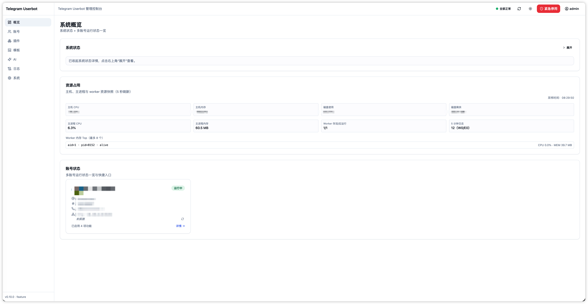
  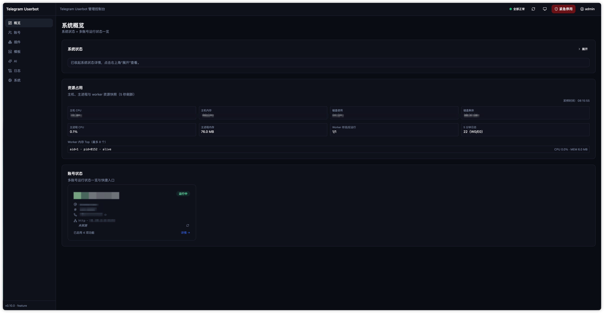
</p>
> 插件中心按平台能力 / 官方可选插件 / 远程插件 / 实验性能力分区，并支持远程插件装配
<p align="center">
  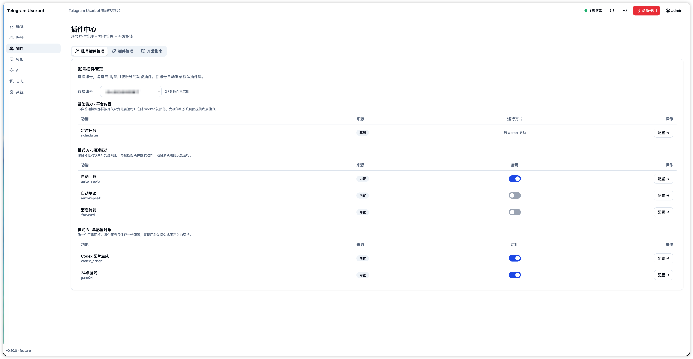
  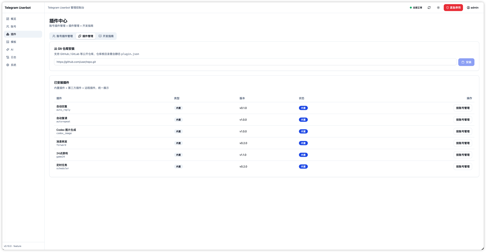
</p>
> 插件配置展示 / 日志中心以 Trace 链路为主，Runtime 与 Audit 作为高级排障 fallback
<p align="center">
  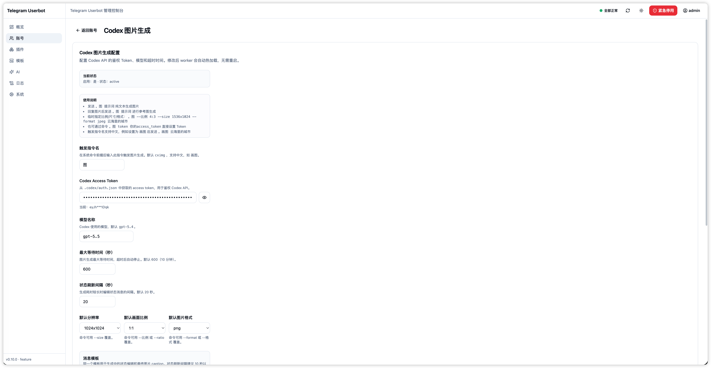
  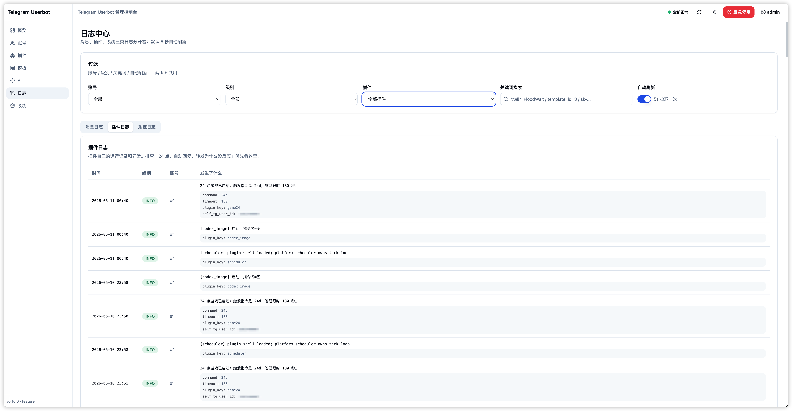
</p>
> 账号级隔离的 Bot 联动支持 / AI 中心配置展示
<p align="center">
  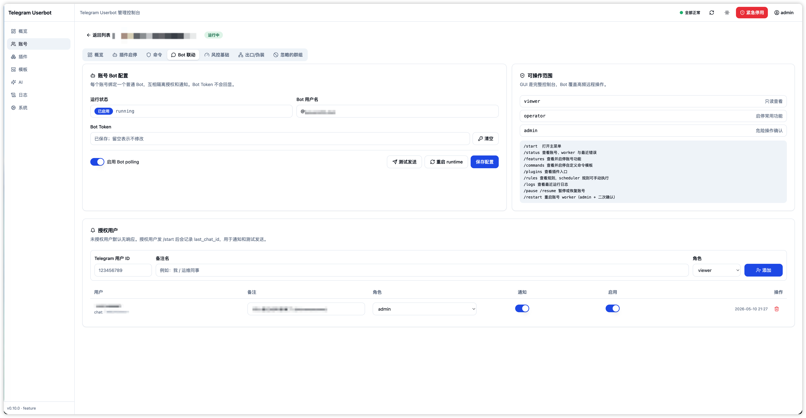
  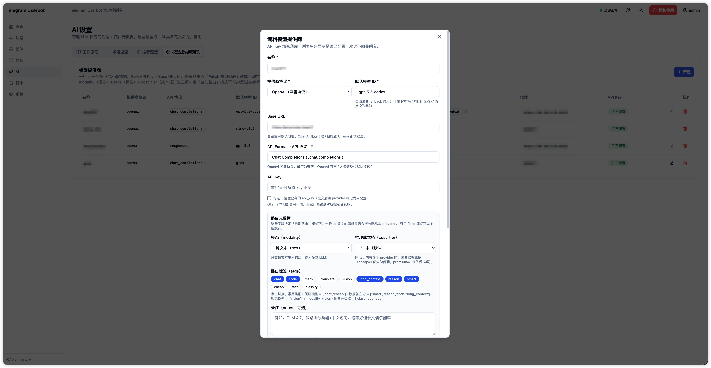
</p>
> 账号详情页风控展示 / 支持自定义指令
<p align="center">
  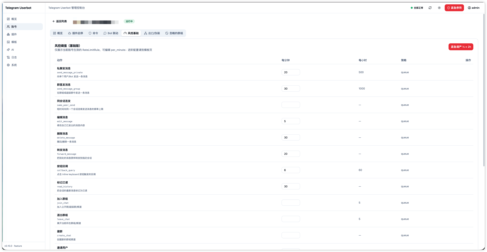
  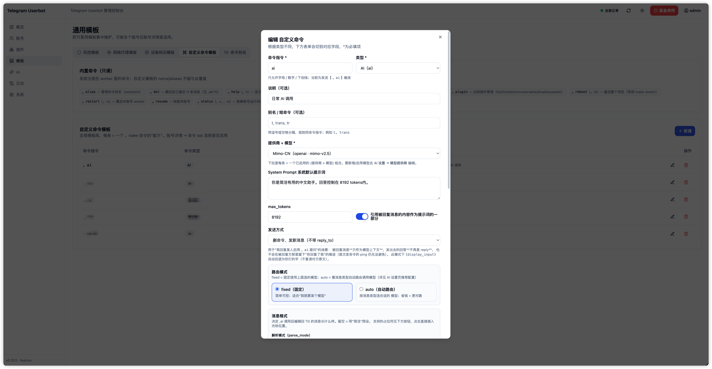
</p>
> iPhone PWA 适配展示
<p align="center">
  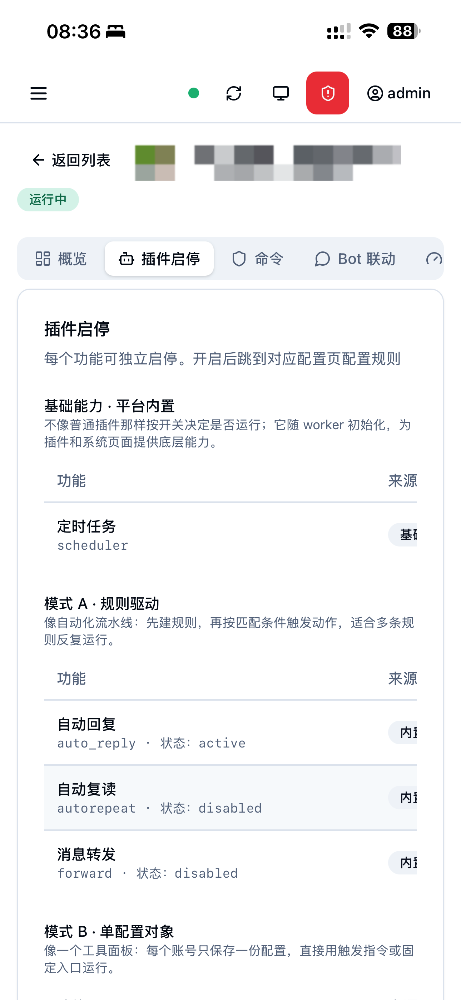
  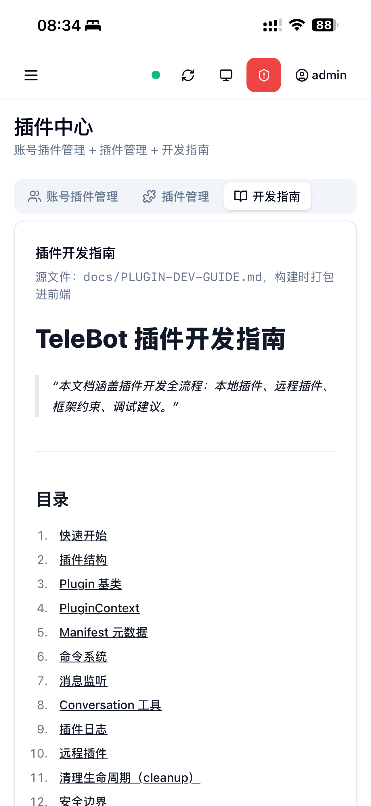
</p>


</details>

<details>
<summary><strong>技术与架构详情</strong></summary>

<br />

## 架构概览

如果你只是想部署使用，可以先跳过这一段；它主要给想改代码或排查问题的人看。

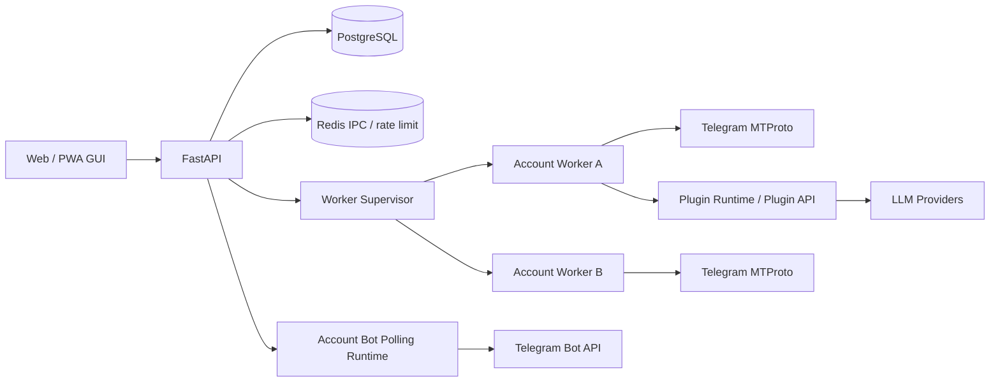

架构图详细说明见 [docs/TELEPILOT-ARCHITECTURE.md](docs/TELEPILOT-ARCHITECTURE.md)。

### 运行模型

- FastAPI 主进程负责 Web API、认证、配置管理、账号 Bot polling runtime 和 worker supervisor。
- 每个账号一个独立 worker 子进程，负责 Telethon 客户端、插件派发、定时任务和 Telegram 消息处理。
- Redis 用于 IPC、热加载通知、限速令牌桶和部分确认 payload。
- PostgreSQL 保存账号、规则、模板、插件配置、日志、审计和加密后的敏感字段。

### TelePilot 命名与兼容说明

- 0.15.0 起，产品名、Web/PWA 标题、前后端包名、启动通知和指令输出统一为 `TelePilot`。
- 为避免老用户升级后“看起来启动成功但数据不见”，Docker volume、数据库默认账号/库名、`TELEBOT_WORKER_PROC` 环境标记等底层兼容名暂时保留。
- 前端默认发送 `X-Requested-With: telepilot-ui` 并自动携带 double-submit CSRF token；后端过渡期同时接受旧的 `telebot-ui` 自定义头，避免旧页面缓存或脚本直接 403。
- 用户界面和文档统一使用“插件 / 指令”口径；代码、API、数据库和文档引用实际字段时仍可保留 `plugin` / `feature` / `command` 等稳定内部名。
- 插件最低版本字段推荐使用 `min_telepilot_version`；旧插件里的 `min_telebot_version` 仍作为 legacy alias 解析。
- 0.18 线主要入口已收敛为“概览 / 插件 / AI / 日志 / 系统”，账号操作集中到概览和账号详情抽屉入口，独立账号页已退出主导航。
- 插件框架采用个人可信插件标准：管理员安装并启用插件后，业务风险由安装者自行承担；平台负责 Event Bus 标准事件信封、Trace、MessageOps 受控代发、风险提示、审计、调试告警和客观失败返回。新插件应声明 `usage`、`event_subscriptions`、`capabilities`；旧 `interaction_entries`、平铺 payload、`notice` / `bbot_notice` 只作为迁移说明，群里的转账结果通知 Bot 只作为外部到账证据来源。
- 插件生态按身份分层迁移：平台功能不伪装成插件；官方可选插件和官方远程插件必须完整声明使用说明、订阅事件和能力；示例插件只用于开发学习和 CI；用户安装插件不强制改代码，但安装/启用/更新时要显示规范警告和废弃通道错误。

## 内置功能

| 类型 | 功能 | 说明 |
| --- | --- | --- |
| 账号 | 多账号绑定 | Web 向导输入 API ID / API Hash / 手机号，支持验证码和两步密码 |
| 账号 | 代理与设备伪装 | 每账号可选择代理、设备 profile、语言参数 |
| 账号 | 风控基础 | 全局限速、账号限速、FloodWait / PeerFlood 处理和拟人化发送 |
| 官方推荐插件 | 自动回复 | 首次部署按需安装，支持关键词 / 正则 / 作用域 / 冷却 / 白名单，安装后可手动卸载 |
| 插件 | 消息转发 | 原生转发、复制、引用、仅链接等模式 |
| 官方推荐插件 | 自动复读 | 首次部署按需安装，支持群聊重复消息检测和自动复读，安装后可手动卸载 |
| 官方可选插件 | ChatGPT2API / Codex 图片生成 / 24 点 / 随机算数题 | 由官方远程插件仓库分发，需在“安装插件”页按需安装，不再作为内置插件自动启用 |
| 平台 | 定时任务 | cron / once / interval，作为 worker 平台调度能力运行 |
| AI | 自定义指令模板 | reply_text / forward_to / run_plugin / ai 多类型模板，provider 缺失会在前端显式提示 |
| AI | LLM Provider | OpenAI 兼容、Anthropic、Ollama、自定义 endpoint、proxy、tag 路由 |
| Bot | 账号 Bot 联动 | 每账号独立 Bot Token、授权用户、viewer/operator/admin 角色 |
| 日志 | 可观测性 | Trace 事件链路、插件动作、reason_code、Runtime / Audit fallback、资源占用和系统健康检查 |

## 技术栈

- 后端：Python 3.12, FastAPI, SQLAlchemy 2, Alembic, PostgreSQL 16, Redis, Telethon 1.43+
- 前端：React 18, TypeScript, Vite, TailwindCSS, TanStack Query, Radix UI, PWA
- Worker：multiprocessing spawn，每账号一个子进程，Redis IPC
- 插件运行时：Plugin 基类 + loader + manifest/config_schema + generation guard
- AI：多 provider router, retry/fallback, usage record, token/cost limit
- 部署：Docker Compose, Nginx frontend, FastAPI web, PostgreSQL, Redis

</details>

## 详细启动方式

先选一种你舒服的方式：

| 场景 | 推荐方式 | 适合谁 |
| --- | --- | --- |
| 只是本机试用 / 开发 | `make up` | 有 Docker Desktop / Docker Engine，想先跑起来看看 |
| VPS 上自己用 | 一条命令安装 | Ubuntu / Debian 服务器，想少配一点东西 |
| 已有 Docker / Docker Compose | `./scripts/init-prod-env.sh` + `docker compose up -d --build` | 想从 GitHub 克隆后尽快跑起来 |
| 已经克隆仓库 | `make init-prod-env` + `make prod-up` | 熟悉一点命令行，想用项目脚本启动 |
| 不想全套 Docker | 源码混合运行 | 已有 PostgreSQL / Redis，或只想 Docker 跑数据库 |

### 1. 准备 Telegram API 凭据

到 [my.telegram.org](https://my.telegram.org) 申请 `API ID` 和 `API Hash`。每个账号绑定时会在 Web 向导中填写，敏感字段会加密落库。

<details>
<summary><strong>本机 / VPS 一键启动说明</strong></summary>

<br />

### 2. 本机最快跑起来

```bash
git clone https://github.com/Anoyou/telebot telepilot
cd telepilot
make up
```

首次启动会自动生成 `.env`、安装依赖，并启动数据库、Redis、后端和前端。

打开：

- 前端：http://localhost:5173
- 后端：http://localhost:8000

常用命令：

```bash
make status
make logs
make restart
make down
```

### 3. VPS 一条命令安装

```bash
curl -fsSL https://raw.githubusercontent.com/Anoyou/telebot/main/scripts/install-server.sh | bash
```

这条命令会安装需要的基础依赖、拉取仓库、生成生产 `.env`，并启动服务。默认安装到 `/opt/telepilot`。

想指定端口或安装目录：

```bash
curl -fsSL https://raw.githubusercontent.com/Anoyou/telebot/main/scripts/install-server.sh \
  | env TELEPILOT_DIR=/opt/telepilot WEB_PORT_PUBLISH=8080 TELEPILOT_BRANCH=main bash
```

公网 HTTPS、域名和反代配置见 [公网部署指南](docs/DEPLOY-PUBLIC.md)。

</details>

### 4. 最轻量 Docker Compose

如果你已经有 Docker 和 Docker Compose，只想从 GitHub 克隆后尽快跑起来：

```bash
git clone https://github.com/Anoyou/telebot telepilot
cd telepilot

./scripts/init-prod-env.sh
docker compose up -d --build
```

脚本会生成生产可用 `.env`，包括 `MASTER_KEY`、`JWT_SECRET`、`POSTGRES_PASSWORD`、`WEB_PORT_PUBLISH=8080` 和保守的内存参数。想改端口：

```bash
./scripts/init-prod-env.sh --port 8088
```

这几个字段的含义：

- `MASTER_KEY`：Fernet 加密主密钥，用来加密 Telegram session、API Hash、Bot Token、LLM API Key 等敏感数据。它必须长期保存；计划内轮换可使用 `python -m app.scripts.rekey`，但丢失后旧密文仍无法恢复。
- `JWT_SECRET`：Web 登录 cookie/JWT 的签名密钥，用来证明“这个登录态是服务器签发的”。泄露后别人可能伪造登录态；更换后所有已登录浏览器会退出。
- `POSTGRES_USER` / `POSTGRES_DB`：PostgreSQL 的用户名和数据库名。新部署建议用小写 `telepilot`；旧文档和默认 compose 里偶尔能看到 `telebot`，那是项目改名以前留下的兼容默认值。已有部署保持原值即可，不要为了改名直接改这两项，否则会连到一个新的空数据库或导致连接失败。
- `POSTGRES_PASSWORD`：PostgreSQL 数据库密码，随便生成一段强随机字符串即可，不要用 `telepilot`、`telebot`、`password` 这类弱密码。

打开 `http://服务器IP:8080` 后，先注册第一个 Web 管理员。

<details>
<summary><strong>启动后哪些能在 Web 面板配置？</strong></summary>

<br />

后续绝大多数业务配置都可以在 Web 面板完成，不需要继续改 `.env`：

| 可以在 Web 面板配置 | 入口 |
| --- | --- |
| Web 管理员、登录与 2FA | 首次访问 / 系统设置 |
| Telegram 账号绑定、API ID / API Hash、验证码、两步密码 | 概览 → 新增账号 |
| 账号代理、默认设备信息、风控和拟人化参数 | 账号详情 / 系统设置 |
| 插件启停、自动回复、转发、复读、24 点、定时任务 | 插件中心；自动回复、复读、24 点等官方可选插件需先到“安装插件”页按需安装 |
| AI Provider、模型列表、API Key、路由标签和 AI 指令模板 | AI 中心 / 插件中心 |
| 普通 Bot Token、群互动 Bot、授权用户 | 账号详情 → Bot |
| 远程插件安装、更新、账号级启用和配置 | 插件中心 → 安装插件 |

仍建议放在启动配置或反代配置里的内容：

| 不能只靠 Web 面板配置 | 原因 |
| --- | --- |
| `MASTER_KEY` | 加密 session、API Hash、Bot Token、LLM Key 等敏感数据；丢失或更换后旧密文无法解密 |
| `JWT_SECRET` | Web 登录签名密钥；更换会让现有登录态失效，需要重启后重新登录 |
| `POSTGRES_*` / `DATABASE_URL`、`REDIS_URL` | 基础存储连接，服务启动前必须可用 |
| `WEB_PORT_PUBLISH`、域名、HTTPS、Caddy/Nginx 反代 | 属于容器和公网入口配置，不在应用数据库里 |
| `COOKIE_SECURE`、`TRUST_FORWARDED_FOR` | 跟 HTTPS 和可信反代边界有关，公网部署前要想清楚 |
| 内存、连接池和 worker 调优项 | 影响进程启动与资源上限，低配 VPS 建议在 `.env` 里调 |
| `TG_DEFAULT_PROXY` | 只是全局兜底代理；更推荐启动后在 Web 里建代理并按账号选择 |

生产挂域名时通常把 `WEB_PORT_PUBLISH` 改成 `127.0.0.1:8080`，再由 Caddy/Nginx 对外提供 HTTPS，并把 `COOKIE_SECURE=true`。

</details>

<details>
<summary><strong>更多启动方式、低配 VPS 调优与配置说明</strong></summary>

<br />

### 5. 已克隆仓库的生产部署

```bash
make init-prod-env
make prod-up
```

`make prod-up` 会用 Docker Compose 启动 `postgres` / `redis` / `web` / `frontend` 四个服务。

最少要关心这几个配置：

```bash
MASTER_KEY=用于加密敏感数据，不能丢
JWT_SECRET=网页登录签名密钥
POSTGRES_PASSWORD=数据库密码，生产环境不要用默认值
COOKIE_SECURE=false  # HTTPS 部署改 true
```

生成密钥示例：

```bash
python -c "from cryptography.fernet import Fernet; print(Fernet.generate_key().decode())"
python -c "import secrets; print(secrets.token_urlsafe(64))"
```

### 6. 不想全套 Docker：源码混合运行

如果你不想把后端和前端都放进 Docker，也可以只用 Docker 跑 PostgreSQL / Redis：

```bash
make bootstrap
make dev-up
make migrate
```

然后开两个终端：

```bash
# 终端 1
make backend

# 终端 2
make frontend
```

如果你已经有自己的 PostgreSQL / Redis，可以直接在 `.env` 里改 `DATABASE_URL` / `REDIS_URL`，然后跳过 `make dev-up`。

### 小 VPS 内存建议

`scripts/_lib.sh::auto_tune_env` 在 `make up` / `make prod-up` 启动时会按宿主机
RAM 自动写入档位（`tiny` ≤ 1.2 GiB / `small` 1.2-2.5 GiB / `large` > 2.5 GiB），
并把 `mem_limit`、Postgres 缓存、Redis 上限、连接池都按档位收紧到 `.env`。
在 `.env` 中设 `MEMORY_TIER=manual` 即可禁用自动覆写，所有键都按你手动设置生效。

进一步可以在 `.env` 里继续压低（适用于把 1G 机器压到极限的场景）：

```bash
MEMORY_TIER=manual           # 自动档让出控制权
WEB_MEM_LIMIT=288m
POSTGRES_MEM_LIMIT=128m
REDIS_MEM_LIMIT=32m
DB_POOL_SIZE=2
DB_MAX_OVERFLOW=0
DB_POOL_SIZE_WORKER=1
DB_MAX_OVERFLOW_WORKER=0
REDIS_MAX_CONNECTIONS=6
REDIS_MAX_CONNECTIONS_WORKER=2
REDIS_MAXMEMORY=24mb
POSTGRES_SHARED_BUFFERS=24MB
POSTGRES_MAX_CONNECTIONS=12
WORKER_RECONCILE_SECONDS=300
LOG_INCOMING_MESSAGES_DEFAULT=false   # 默认就是 false；若需要排查再改 true
```

每个已激活 Telegram 账号仍会常驻一个独立 worker 进程，账号数是内存占用的主要变量；
小机器上建议只启用实际需要在线的账号和插件。

更细的减负开关：

- `LOG_INCOMING_MESSAGES_DEFAULT=false`（默认）— 不再为每条 incoming 消息额外
  写一行可见性 runtime_log；指令派发、插件错误、业务事件等独立日志一律保留。
  排查时可在系统设置 `system_setting` 里把 key=`log_incoming_messages` 设为
  `{"enabled": true}` 临时打开。
- `WORKER_RECONCILE_SECONDS=180`（默认）— worker 周期性重拉指令模板/规则的
  IPC 兜底间隔；纯热更新场景 reload 是即时的，180 秒足够兜底。
- `DB_POOL_SIZE_WORKER=1` / `REDIS_MAX_CONNECTIONS_WORKER=4`（默认）— 每个
  worker 子进程独立的连接池上限；多账号时直接乘以账号数，故按 worker 真实
  并发收紧很关键。

## 配置重点

| 配置 | 说明 |
| --- | --- |
| `MASTER_KEY` | Fernet 主密钥，用于加密 session、api_id、api_hash、totp_secret、Bot Token。丢失后加密数据无法恢复 |
| `JWT_SECRET` | Web 登录 JWT 签名密钥 |
| `COOKIE_SECURE` | HTTPS 部署设为 `true`，本地 HTTP 调试保持 `false` |
| `DATABASE_URL` | PostgreSQL async DSN |
| `DB_POOL_SIZE` / `DB_MAX_OVERFLOW` | 后端与每个 worker 的数据库连接池上限，小 VPS 不宜过大 |
| `REDIS_URL` | Redis 连接地址 |
| `REDIS_MAX_CONNECTIONS` | 后端与每个 worker 的 Redis 客户端连接池上限 |
| `TG_DEFAULT_PROXY` | 默认 Telegram 出口代理，可被账号级代理覆盖 |
| `TRUST_FORWARDED_FOR` | 只有在可信反代后方才设为 `true` |
| `AUTO_MIGRATE_ON_STARTUP` | 生产建议 `false`，由部署流程显式执行迁移 |

更多安全建议见 [docs/SECURITY-OPS.md](docs/SECURITY-OPS.md)。

</details>

<details>
<summary><strong>插件开发、安全边界与验证命令</strong></summary>

<br />

## 插件开发

TelePilot 用户界面和文档统一称“插件”，代码层仍使用 `Plugin` / `feature` 作为稳定 API 和数据库命名。新增插件按前端配置体验分为几类：

| 形态 | 说明 | 示例 |
| --- | --- | --- |
| 规则配置页 | 多条规则的配置、CRUD 和试运行；Telegram 事件投递仍走 Event Bus + `event_subscriptions` | forward；官方可选 `auto_reply`、`autorepeat`；远程规则插件 |
| 通用独立配置页 | 每账号保存一份配置，像一个工具面板；没有专属页面的轻量插件也走通用独立页 | 官方可选 `game24`、`math10`、`codex_image`、`chatgpt_image`；轻量远程插件 |
| 平台基础能力 | 随 worker 初始化，为系统和插件提供能力 | scheduler |

不再新增“Schema 弹窗”类插件。`config_schema` 仍是字段、默认值、校验和配置页渲染的数据来源；旧 `x-ui-mode: "schema"` 只作为兼容别名处理，新增插件请优先声明 `rules`、`single` 或 `platform`。这里的 `rules` 只表示前端配置页形态，不是旧运行时规则驱动主路径；新 Telegram 插件仍应通过 `event_subscriptions` 接收事件，并通过 `ctx.messages` 或标准 action 输出结果。配置页必须使用独立页面，并按“使用说明 → 功能总开关 → 插件配置 → 插件预览”的顺序组织；有保存字段时，配置操作条固定在“插件配置”卡片底部。插件必须自己声明详细使用说明，缺失时会显示红色高级规范警告；消息预览是建议项，不阻断运行。

开发文档：

- [5 分钟写出第一个插件](docs/PLUGIN-QUICKSTART.md)
- [插件开发铁律](docs/PLUGIN-RULES.md)
- [插件开发指南（索引、完整 API、官方插件库与远程插件）](docs/PLUGIN-DEV-GUIDE.md)

## 安全边界

TelePilot 默认做了多层防护，但它仍然是一个能操控 Telegram 用户账号的系统：

- 不要把管理后台裸露在公网 HTTP。
- 不要复用弱密码、默认数据库密码或示例密钥。
- 不要把 `.env`、数据库备份、session、Bot Token、LLM API Key 发到聊天或截图里。
- 远程插件只安装可信来源；第三方插件启用前先读代码。
- 插件开发请按最终版 Event Bus + Trace + MessageOps 口径编写：`plugin.json` 声明 `usage`、`event_subscriptions`、`capabilities`，运行时读取标准事件信封，主动消息、按钮 ACK、Inline answer 和 `settlement` 都通过 `ctx.messages` 或标准 action 交给平台执行；旧 `interaction_entries` / 平铺 payload / `notice` 只用于迁移说明。
- UserBot 行为可能触发 Telegram 风控，请谨慎设置自动回复、群发、定时任务和 AI 指令。

## 开发与验证

```bash
# 后端测试
cd backend
. .venv/bin/activate
pytest -v

# 后端静态检查
ruff check app

# 前端类型检查与构建
cd ..
pnpm -C frontend exec tsc -b --noEmit
pnpm -C frontend build
```

发布前建议至少跑后端测试、后端静态检查、前端类型检查和前端生产构建。本文档不记录过期的本地验证结果，避免和当前工作区状态混淆。

</details>

## 文档入口

- [变更日志](CHANGELOG.md)
- [公网部署](docs/DEPLOY-PUBLIC.md)
- [安全运维](docs/SECURITY-OPS.md)
- [插件 Quickstart](docs/PLUGIN-QUICKSTART.md)
- [插件开发铁律](docs/PLUGIN-RULES.md)
- [插件开发指南索引](docs/PLUGIN-DEV-GUIDE.md)
- [贡献指南](CONTRIBUTING.md)

## 项目状态

当前版本：`v0.41.4`

项目处于 Alpha / 个人自用阶段。核心链路已经能跑，但仍在快速迭代中，接口、页面和插件规范可能继续调整。欢迎 fork、参考和提 issue；大规模 PR 建议先开 issue 对齐方向。

## License

MIT - 见 [LICENSE](LICENSE)。

## 致谢

- [Telethon](https://github.com/LonamiWebs/Telethon) - Telegram MTProto 客户端
- [FastAPI](https://fastapi.tiangolo.com/) - 后端 Web 框架
- [React](https://react.dev/) - 前端 UI 框架
- [Tailwind CSS](https://tailwindcss.com/) - 前端样式系统
