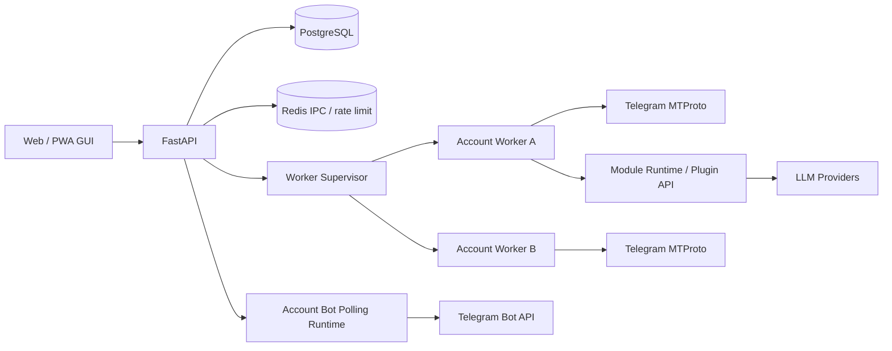

# TelePilot - 多账号 Telegram UserBot 管理控制台

[](LICENSE)
[](backend/pyproject.toml)
[](frontend/package.json)
[](#项目状态)

TelePilot 是一个自托管的 Telegram UserBot 多账号管理平台。它用 Web GUI 管理多个 Telegram 个人账号，每个账号独立运行 worker 子进程，并提供模块、规则、AI 指令、风控、日志、账号 Bot 联动与 PWA 管理体验。当前 0.18 线已经完成 TelePilot 品牌、PWA 导航、概览信息架构、资源占用面板和模块配置页体验的收口，同时保留旧数据卷、数据库默认名、模块旧字段和旧前端请求头的兼容。

> 这是个人 Vibe 自用取向的项目，仍处于 Alpha 阶段。UserBot 使用的是 Telegram MTProto 用户账号能力，不是 Bot API；请自行评估账号风控、合规和安全风险。

## 核心能力

- 多账号管理：每个 Telegram 账号独立登录、独立配置、独立 worker 子进程运行。
- Web 控制台：概览、模块、AI、日志、系统设置集中管理，支持浅色 / 深色 / 跟随系统主题。
- PWA 体验：支持安装到桌面或手机主屏幕，针对 iPhone 安全区、窄屏 Tab 和自适应排版做了优化。
- 模块中心：平台能力、内置模块、远程模块、实验性能力分区展示，支持按账号视角查看和配置。
- 模块系统：代码层仍基于 `Plugin` / `feature`，用户界面统一称“模块”；支持内置模块、远程模块、热加载、generation guard、生命周期钩子、配置 schema。模块前端模式推荐使用 `rules` / `single` / `platform`；旧 `schema` 仅作为兼容别名或普通单配置独立页的字段来源。第三方模块推荐使用 `min_telepilot_version`，旧 `min_telebot_version` 仍兼容。
- 规则驱动模块：自动回复、消息转发、自动复读等按规则匹配并执行。
- 单配置对象模块：Game24 等以账号级配置页管理；Codex 图片生成已下沉为 installed 实验模块，旧账号保留兼容加载。
- 平台基础能力：定时任务调度器作为 worker 常驻能力运行，模块和系统页面可复用。
- AI 中心：Providers、Routing、Usage 分入口管理，支持多 provider、fallback、retry、usage 记录、预算限制、自定义 AI 指令与 Telegram 长回复分段。
- 账号 Bot 联动：每个 UserBot 账号可绑定一个普通 Bot，作为移动端/远程运维入口，支持授权用户、角色和常用操作。
- 可观测性：系统状态、资源占用、Runtime 日志、Audit 审计日志、模块筛选与日志保留策略。
- 安全基础：Fernet 加密 session / api_id / api_hash / Bot Token，JWT 登录，TOTP，Sudo 默认拒绝，高危 Telegram 指令移除，account_bot 危险操作二次确认，远程模块安装阶段静态 manifest 校验。

## 截图

> 浅色/深色/跟随系统 主题展示
<p align="center">
  
  
</p>
> 模块中心按平台能力 / 内置模块 / 远程模块 / 实验性能力分区，并支持远程模块装配
<p align="center">
  
  
</p>
> 模块配置展示 / 日志中心支持 Runtime 与 Audit 分开排查
<p align="center">
  
  
</p>
> 账号级隔离的 Bot 联动支持 / AI 中心配置展示
<p align="center">
  
  
</p>
> 账号详情页风控展示 / 支持自定义指令
<p align="center">
  
  
</p>
> iPhone PWA 适配展示
<p align="center">
  
  
</p>


## 架构概览



架构图详细说明见 [docs/TELEPILOT-ARCHITECTURE.md](docs/TELEPILOT-ARCHITECTURE.md)。

### 运行模型

- FastAPI 主进程负责 Web API、认证、配置管理、账号 Bot polling runtime 和 worker supervisor。
- 每个账号一个独立 worker 子进程，负责 Telethon 客户端、模块派发、定时任务和 Telegram 消息处理。
- Redis 用于 IPC、热加载通知、限速令牌桶和部分确认 payload。
- PostgreSQL 保存账号、规则、模板、模块配置、日志、审计和加密后的敏感字段。

### TelePilot 命名与兼容说明

- 0.15.0 起，产品名、Web/PWA 标题、前后端包名、启动通知和指令输出统一为 `TelePilot`。
- 为避免老用户升级后“看起来启动成功但数据不见”，Docker volume、数据库默认账号/库名、`TELEBOT_WORKER_PROC` 环境标记等底层兼容名暂时保留。
- 前端默认发送 `X-Requested-With: telepilot-ui`，后端过渡期同时接受旧的 `telebot-ui`，避免旧页面缓存或脚本直接 403。
- 用户界面统一使用“模块 / 指令”口径；代码、API、数据库和开发文档中仍可保留 `plugin` / `feature` / `command` 等稳定内部名。
- 模块最低版本字段推荐使用 `min_telepilot_version`；旧模块里的 `min_telebot_version` 仍作为 legacy alias 解析。
- 0.18 线主要入口已收敛为“概览 / 模块 / AI / 日志 / 系统”，账号操作集中到概览和账号详情抽屉入口，独立账号页已退出主导航。

## 内置功能

| 类型 | 功能 | 说明 |
| --- | --- | --- |
| 账号 | 多账号绑定 | Web 向导输入 API ID / API Hash / 手机号，支持验证码和两步密码 |
| 账号 | 代理与设备伪装 | 每账号可选择代理、设备 profile、语言参数 |
| 账号 | 风控基础 | 全局限速、账号限速、FloodWait / PeerFlood 处理和拟人化发送 |
| 模块 | 自动回复 | 关键词 / 正则 / 作用域 / 冷却 / 白名单 |
| 模块 | 消息转发 | 原生转发、复制、引用、仅链接等模式 |
| 模块 | 自动复读 | 群聊重复消息检测和自动复读 |
| 模块 | Codex 图片生成 | 已下沉到 `plugins/installed/codex_image/`，旧账号兼容加载；支持模板、尺寸、比例、格式和指令覆盖，当前标记为实验性 |
| 平台 | 定时任务 | cron / once / interval，作为 worker 平台调度能力运行 |
| AI | 自定义指令模板 | reply_text / forward_to / run_plugin / ai 多类型模板，provider 缺失会在前端显式提示 |
| AI | LLM Provider | OpenAI 兼容、Anthropic、Ollama、自定义 endpoint、proxy、tag 路由 |
| Bot | 账号 Bot 联动 | 每账号独立 Bot Token、授权用户、viewer/operator/admin 角色 |
| 日志 | 可观测性 | Runtime 日志、Audit 审计日志、资源占用和系统健康检查 |

## 技术栈

- 后端：Python 3.12, FastAPI, SQLAlchemy 2, Alembic, PostgreSQL 16, Redis, Telethon 1.43+
- 前端：React 18, TypeScript, Vite, TailwindCSS, TanStack Query, Radix UI, PWA
- Worker：multiprocessing spawn，每账号一个子进程，Redis IPC
- 模块运行时：Plugin 基类 + loader + manifest/config_schema + generation guard
- AI：多 provider router, retry/fallback, usage record, token/cost limit
- 部署：Docker Compose, Nginx frontend, FastAPI web, PostgreSQL, Redis

## 快速开始

### 1. 准备 Telegram API 凭据

到 [my.telegram.org](https://my.telegram.org) 申请 `API ID` 和 `API Hash`。每个账号绑定时会在 Web 向导中填写，敏感字段会加密落库。

### 2. 初始化环境变量

```bash
git clone https://github.com/Anoyou/telebot telepilot
cd telepilot
cp .env.example .env
```

至少修改 `.env` 中这些值：

```bash
MASTER_KEY=replace-with-fernet-key
JWT_SECRET=replace-with-long-random-secret
POSTGRES_PASSWORD=replace-in-production
COOKIE_SECURE=false
```

生成密钥示例：

```bash
python -c "from cryptography.fernet import Fernet; print(Fernet.generate_key().decode())"
python -c "import secrets; print(secrets.token_urlsafe(64))"
```

### 3. 本地开发启动

推荐使用项目 Makefile：

```bash
make up
```

常用命令：

```bash
make status
make logs
make restart
make down
```

默认访问：

- 前端：http://localhost:5173
- 后端：http://localhost:8000

首次打开登录页时，如果系统还没有管理员账号，可以直接创建管理员。

### 4. 服务器开箱部署

SSH 到 Debian / Ubuntu 服务器后，可直接执行：

```bash
curl -fsSL https://raw.githubusercontent.com/Anoyou/telebot/main/scripts/install-server.sh | bash
```

这条命令会自动安装基础依赖与 Docker Compose v2、拉取仓库、生成生产 `.env`，然后调用 `make prod-up` 启动 `postgres` / `redis` / `web` / `frontend` 四个容器。默认安装到 `/opt/telepilot`，默认对外发布 80 端口。

可通过环境变量覆盖安装目录、分支或端口：

```bash
curl -fsSL https://raw.githubusercontent.com/Anoyou/telebot/main/scripts/install-server.sh \
  | env TELEPILOT_DIR=/opt/telepilot WEB_PORT_PUBLISH=8080 TELEPILOT_BRANCH=main bash
```

如果是非 apt 系发行版，请先手动安装 Docker Compose v2、Git、Make 和 Python 3，再执行同一条命令。

### 5. 已克隆仓库内 Docker 部署

```bash
cp .env.example .env
# 修改 MASTER_KEY / JWT_SECRET / POSTGRES_PASSWORD / COOKIE_SECURE 等
make prod-up
```

`make prod-up` 会检查生产配置、自动调优 `.env`，并通过 Docker Compose 构建启动 `postgres` / `redis` / `web` / `frontend` 四个容器。也可以直接执行 `docker compose up -d --build`。

默认前端监听宿主机 80 端口。公网 HTTPS 部署请参考 [docs/DEPLOY-PUBLIC.md](docs/DEPLOY-PUBLIC.md)。

Compose 会持久化数据库、Redis、Telegram session、远程模块安装目录和模块仓库缓存。不要把 `plugins/installed`、`data/plugin_repos` 改成容器内临时目录，否则重建 web 容器后远程模块文件会丢失，表现为“指令能收到但模块没有反应”。

### 小 VPS 内存建议

`scripts/_lib.sh::auto_tune_env` 在 `make up` / `make prod-up` 启动时会按宿主机
RAM 自动写入档位（`tiny` ≤ 1.2 GiB / `small` 1.2-2.5 GiB / `large` > 2.5 GiB），
并把 `mem_limit`、Postgres 缓存、Redis 上限、连接池都按档位收紧到 `.env`。
在 `.env` 中设 `MEMORY_TIER=manual` 即可禁用自动覆写，所有键都按你手动设置生效。

进一步可以在 `.env` 里继续压低（适用于把 1G 机器压到极限的场景）：

```bash
MEMORY_TIER=manual           # 自动档让出控制权
WEB_MEM_LIMIT=288m
POSTGRES_MEM_LIMIT=128m
REDIS_MEM_LIMIT=32m
DB_POOL_SIZE=2
DB_MAX_OVERFLOW=0
DB_POOL_SIZE_WORKER=1
DB_MAX_OVERFLOW_WORKER=0
REDIS_MAX_CONNECTIONS=6
REDIS_MAX_CONNECTIONS_WORKER=2
REDIS_MAXMEMORY=24mb
POSTGRES_SHARED_BUFFERS=24MB
POSTGRES_MAX_CONNECTIONS=12
WORKER_RECONCILE_SECONDS=300
LOG_INCOMING_MESSAGES_DEFAULT=false   # 默认就是 false；若需要排查再改 true
```

每个已激活 Telegram 账号仍会常驻一个独立 worker 进程，账号数是内存占用的主要变量；
小机器上建议只启用实际需要在线的账号和模块。

更细的减负开关：

- `LOG_INCOMING_MESSAGES_DEFAULT=false`（默认）— 不再为每条 incoming 消息额外
  写一行可见性 runtime_log；指令派发、模块错误、业务事件等独立日志一律保留。
  排查时可在系统设置 `system_setting` 里把 key=`log_incoming_messages` 设为
  `{"enabled": true}` 临时打开。
- `WORKER_RECONCILE_SECONDS=180`（默认）— worker 周期性重拉指令模板/规则的
  IPC 兜底间隔；纯热更新场景 reload 是即时的，180 秒足够兜底。
- `DB_POOL_SIZE_WORKER=1` / `REDIS_MAX_CONNECTIONS_WORKER=4`（默认）— 每个
  worker 子进程独立的连接池上限；多账号时直接乘以账号数，故按 worker 真实
  并发收紧很关键。

## 配置重点

| 配置 | 说明 |
| --- | --- |
| `MASTER_KEY` | Fernet 主密钥，用于加密 session、api_id、api_hash、totp_secret、Bot Token。丢失后加密数据无法恢复 |
| `JWT_SECRET` | Web 登录 JWT 签名密钥 |
| `COOKIE_SECURE` | HTTPS 部署设为 `true`，本地 HTTP 调试保持 `false` |
| `DATABASE_URL` | PostgreSQL async DSN |
| `DB_POOL_SIZE` / `DB_MAX_OVERFLOW` | 后端与每个 worker 的数据库连接池上限，小 VPS 不宜过大 |
| `REDIS_URL` | Redis 连接地址 |
| `REDIS_MAX_CONNECTIONS` | 后端与每个 worker 的 Redis 客户端连接池上限 |
| `TG_DEFAULT_PROXY` | 默认 Telegram 出口代理，可被账号级代理覆盖 |
| `TRUST_FORWARDED_FOR` | 只有在可信反代后方才设为 `true` |
| `AUTO_MIGRATE_ON_STARTUP` | 生产建议 `false`，由部署流程显式执行迁移 |

更多安全建议见 [docs/SECURITY-OPS.md](docs/SECURITY-OPS.md)。

## 模块开发

TelePilot 用户界面统一称“模块”，代码层仍使用 `Plugin` / `feature` 作为稳定 API 和数据库命名。新增模块按前端配置体验分为几类：

| 形态 | 说明 | 示例 |
| --- | --- | --- |
| 规则驱动 | 多条规则匹配后执行动作 | auto_reply, forward, autorepeat |
| 通用独立配置页 | 每账号保存一份配置，像一个工具面板；没有专属页面的轻量模块也走通用独立页 | game24；codex_image 作为 installed 实验模块兼容保留；轻量远程模块 |
| 平台基础能力 | 随 worker 初始化，为系统和模块提供能力 | scheduler |

不再新增“Schema 弹窗”类模块。`config_schema` 仍是字段、默认值、校验和配置页渲染的数据来源；旧 `x-ui-mode: "schema"` 只作为兼容别名处理，新增模块请优先声明 `rules`、`single` 或 `platform`。配置页必须使用独立页面，并按“顶部配置操作 → 使用说明 → 功能总开关 → 配置主体”的顺序组织。

开发文档：

- [模块开发指南（Plugin API）](docs/PLUGIN-DEV-GUIDE.md)
- [远程模块开发与安装](docs/REMOTE-PLUGIN-GUIDE.md)

## 安全边界

TelePilot 默认做了多层防护，但它仍然是一个能操控 Telegram 用户账号的系统：

- 不要把管理后台裸露在公网 HTTP。
- 不要复用弱密码、默认数据库密码或示例密钥。
- 不要把 `.env`、数据库备份、session、Bot Token、LLM API Key 发到聊天或截图里。
- 远程模块只安装可信来源；第三方模块启用前先读代码。
- UserBot 行为可能触发 Telegram 风控，请谨慎设置自动回复、群发、定时任务和 AI 指令。

## 开发与验证

```bash
# 后端测试
cd backend
. .venv/bin/activate
pytest -v

# 后端静态检查
ruff check app

# 前端类型检查与构建
cd ..
pnpm -C frontend exec tsc -b --noEmit
pnpm -C frontend build
```

发布前建议至少跑后端测试、后端静态检查、前端类型检查和前端生产构建。本文档不记录过期的本地验证结果，避免和当前工作区状态混淆。

## 文档入口

- [变更日志](CHANGELOG.md)
- [公网部署](docs/DEPLOY-PUBLIC.md)
- [安全运维](docs/SECURITY-OPS.md)
- [模块开发指南（Plugin API）](docs/PLUGIN-DEV-GUIDE.md)
- [远程模块开发与安装](docs/REMOTE-PLUGIN-GUIDE.md)
- [贡献指南](CONTRIBUTING.md)

## 项目状态

当前版本：`v0.18.0 · feature`

项目处于 Alpha / 个人自用阶段。核心链路已经能跑，但仍在快速迭代中，接口、页面和模块规范可能继续调整。欢迎 fork、参考和提 issue；大规模 PR 建议先开 issue 对齐方向。

## License

MIT - 见 [LICENSE](LICENSE)。

## 致谢

- [Telethon](https://github.com/LonamiWebs/Telethon) - Telegram MTProto 客户端
- [FastAPI](https://fastapi.tiangolo.com/) - 后端 Web 框架
- [React](https://react.dev/) - 前端 UI 框架
- [Tailwind CSS](https://tailwindcss.com/) - 前端样式系统
