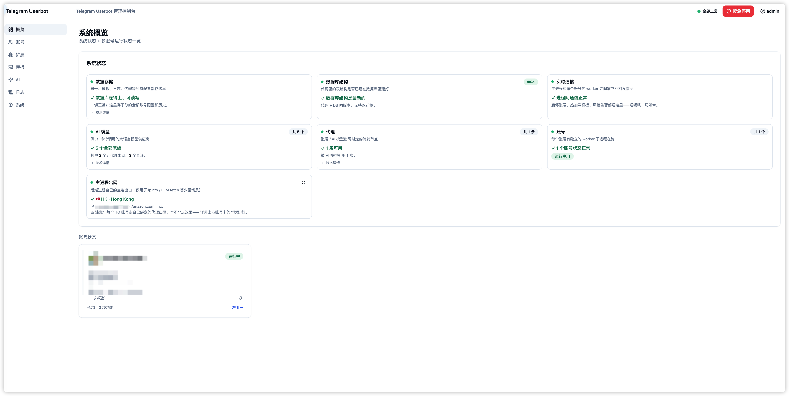

# Telebot — 多账号 Telegram Userbot 管理控制台

> Self-hosted Web UI for managing Telegram userbots: auto-reply, forward, scheduler, custom AI commands, rate limiting.

<!-- [](https://github.com/Anoyou/telebot/actions) -->
[](LICENSE)

## 纯纯用白嫖的 Claude Opus 4.7 Vibe 出来的，想到什么做什么。很多地方还不完善。

## Features

- 🪪 **多账号绑定**：基于 Telethon，支持代理与设备伪装
- 💬 **自动回复**：关键词 / 正则匹配，支持作用域、冷却时间、白名单
- 🔁 **消息转发**：4 种模式（原生 / 复制 / 引用 / 仅链接）
- ⏰ **定时任务**：cron / once / interval 三种模式，支持多账号广播
- 🤖 **自定义命令模板**：含 AI 类型（OpenAI / Anthropic / 自建反代）
- 🛡 **风控引擎**：18 actions × 5 policies × 拟人化 + FloodWait 自适应
- 🔌 **插件开发框架**：不是市场——见 [docs/PLUGIN-DEV-GUIDE.md](docs/PLUGIN-DEV-GUIDE.md)
- 📨 **多 Bot 通知通道**：项目启动 / 故障告警

## Screenshots

<p align="center">
  
  
</p>
<p align="center">
  
  
</p>

## Prerequisites
 
 在开始之前，你需要准备好以下内容：
 
 1.  **Telegram API 凭据**：前往 [my.telegram.org](https://my.telegram.org) 申请 `API_ID` 和 `API_HASH`。
 2.  **网络环境**：由于 Telegram API 在国内无法直接访问，若你使用国内服务器，请确保拥有可用的 SOCKS5 或 HTTP 代理。
 3.  **基础环境**：
     *   **Docker 部署**：安装 Docker 20.10+ 及 Compose V2。
     *   **本地开发**：Python 3.12+，Node.js 18+，Pnpm 8+。
 
 ## Quick Start

### 本机开发（HTTP，适合调试）

```bash
git clone https://github.com/Anoyou/telebot
cd telebot
cp .env.example .env       # 修改 MASTER_KEY / JWT_SECRET
make dev-up                # 启动依赖（PG + Redis）
cd backend && pip install -e .[dev] && alembic upgrade head
uvicorn app.main:app --reload --port 8000
# 另一个终端
cd frontend && pnpm install && pnpm dev
# 访问 http://localhost:5173
```

### Docker 部署（推荐，生产环境）

```bash
git clone https://github.com/Anoyou/telebot
cd telebot
cp .env.example .env           # 务必修改 MASTER_KEY / JWT_SECRET
docker compose up -d --build
# 访问 http://localhost (默认 80 端口)
```

### 公网部署（HTTPS）

见 [docs/DEPLOY-PUBLIC.md](docs/DEPLOY-PUBLIC.md)

## Configuration

项目的核心配置位于 `.env` 文件中：

- **安全项**：务必修改 `MASTER_KEY` 与 `JWT_SECRET`。`MASTER_KEY` 丢失会导致数据库内所有加密数据无法找回。
- **网络代理**：在 `.env` 中设置 `TG_DEFAULT_PROXY` 即可。Docker 模式下访问宿主机代理建议使用 `socks5://host.docker.internal:1080`。

## Tech Stack

- **后端**：Python 3.12 / FastAPI / SQLAlchemy 2 / Alembic / asyncpg / Redis / Telethon 1.43+
- **前端**：React 18 / Vite / TypeScript / TailwindCSS / TanStack Query
- **进程模型**：每账号一个 worker 子进程（mp spawn）+ Redis pub/sub IPC
- **数据库**：PostgreSQL 16

## Development

- **插件开发**：[docs/PLUGIN-DEV-GUIDE.md](docs/PLUGIN-DEV-GUIDE.md)
- **安全运维**：[docs/SECURITY-OPS.md](docs/SECURITY-OPS.md)
- **公网部署**：[docs/DEPLOY-PUBLIC.md](docs/DEPLOY-PUBLIC.md)
- **变更日志**：[CHANGELOG.md](CHANGELOG.md)

## FAQ

### Q: 这跟 PagerMaid 有什么区别？

- PagerMaid 是 Pyrogram 单进程；本项目是 FastAPI Web UI 多账号管理 + worker 子进程隔离 + 现代 React 前端
- 不兼容 PagerMaid 插件（Pyrogram → Telethon），但提供移植指南（见插件开发指南）

### Q: 多用户支持？

- 单租户设计，一个超管账号；多用户不在路线图

### Q: 为什么不用 Bot API 而用 userbot？

- userbot = 你的个人 Telegram 账号，能进所有群、看所有 DM；Bot 只能进被人邀请的群
- 见 [Telegram 官方文档](https://core.telegram.org/api#telegram-api) 关于 user vs bot

## Status

Alpha / 个人自用 / 欢迎 fork 但暂不接大 PR。

## License

MIT — 见 [LICENSE](LICENSE)

## 致谢

- [Telethon](https://github.com/LonamiWebs/Telethon) - 优秀的 Telegram MTProto 客户端库
- [PagerMaid-Pyro](https://github.com/TeamPGM/PagerMaid-Pyro) - 插件机制和命令体系的设计灵感来源

本项目是完全重新实现的架构，借鉴了 PagerMaid-Pyro 的设计理念但使用不同的技术栈和实现方式。
